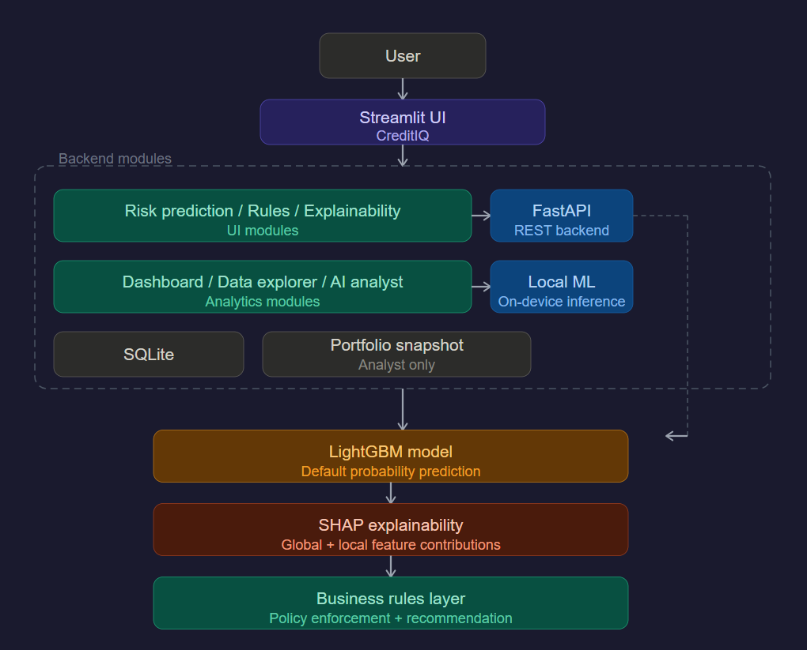
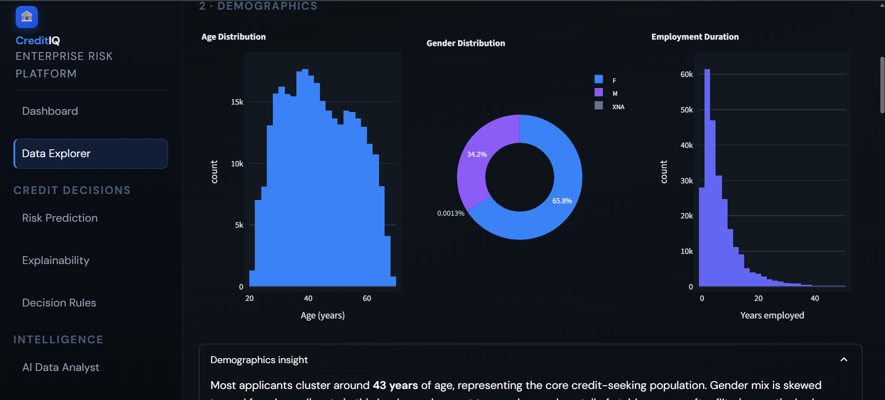
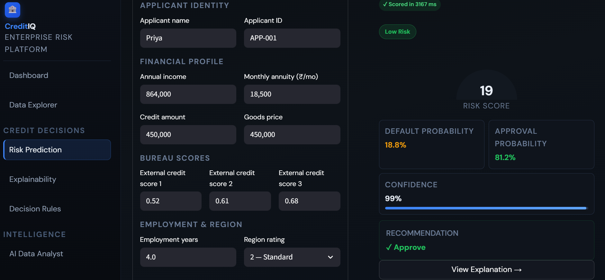
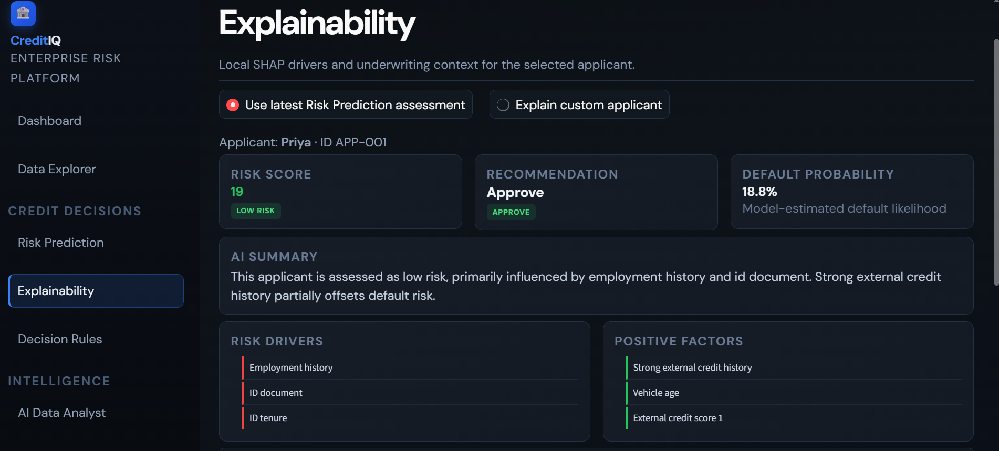
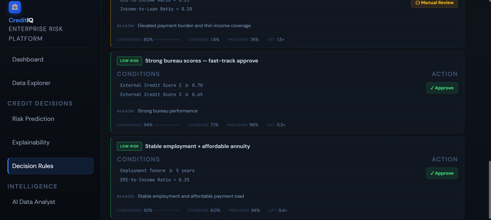
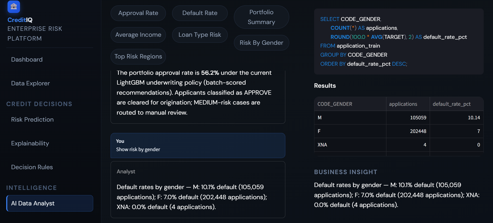

# CreditIQ – AI-Powered Credit Risk Underwriting Platform

CreditIQ is an end-to-end credit risk intelligence workspace built on the **Home Credit Default Risk** dataset. It helps analysts and underwriters move from raw application data to scored decisions, explanations, and portfolio insight in one place.

Traditional underwriting is often **slow**, **inconsistent**, and **hard to explain** to business and compliance stakeholders. This platform combines:

- **Machine learning** — default probability and risk bands  
- **Explainable AI** — SHAP-based drivers at portfolio and applicant level  
- **Business rules** — transparent approve / review / decline policies  
- **Portfolio analytics** — executive KPIs and segment views  
- **Natural language data analysis** — ask portfolio questions in plain English  

…to support faster, more explainable credit decision-making.

| | |
|---|---|
| **Dataset** | Home Credit Default Risk |
| **Records** | 307,511 applications |
| **Target** | Loan default prediction (`TARGET`) |
| **Model** | LightGBM |
| **Explainability** | SHAP (global + local) |
| **Frontend** | Streamlit |
| **Backend** | Python + FastAPI |

**Author:** [Nailasalim](https://github.com/Nailasalim)

---

## Features

Only capabilities that are implemented and available in the app today.

### Executive Dashboard

- Portfolio KPIs (applications, default rate, approval rate, high-risk exposure)  
- Portfolio analytics: risk distribution, approval decision mix, predicted default probability bands, risk segment volume  
- Top risk and positive SHAP drivers  
- Recent session assessments from Risk Prediction  

### Data Explorer

- Dataset overview and KPIs  
- Demographics (age, gender, employment tenure)  
- Financial analysis (income, credit, annuity, scatter views)  
- Risk segmentation and highlights  
- Data quality assessment  
- Interactive Plotly charts with sidebar filters  

### Risk Prediction

- Applicant scoring via FastAPI  
- Probability of default and risk score (0–100)  
- Risk band assignment (Low / Medium / High)  
- Approve / Review / Decline recommendation  
- Session assessment history on the dashboard  

### Explainability

- SHAP-based local explanations per applicant  
- Global feature importance (mean \|SHAP\|)  
- Top drivers and contribution chart  
- Concise AI-style narrative summary  

### Decision Rules

- Underwriting rules engine (structured rule catalog)  
- Live rule matching on applicant payloads  
- Human-readable conditions and rule reasons  
- Confidence, coverage, precision, and lift metrics  

### AI Data Analyst

- Natural language → SQL (deterministic intent matching)  
- Portfolio analytics queries (rates, counts, segments, summaries)  
- Query results as tables  
- Short business insights per answer  
- In-memory **SQLite** over the training data and portfolio KPIs  

### Login & navigation

- Session-based login (demo accounts)  
- Dark enterprise UI with sidebar navigation across all modules  

---

## Architecture

<p align="center">
  
</p>

- **Streamlit** — single app shell (`ui/streamlit_app.py`), page modules per feature.  
- **FastAPI** — inference and rules for individual applicants (`/predict`, `/decision`, `/rules`, `/health`, `/dashboard/summary`).  
- **Portfolio batch scoring** — training CSV scored once; metrics cached in `models/portfolio_scoring_snapshot.json` for the executive dashboard.  
- **AI Data Analyst** — loads `application_train` into **SQLite** in-process for supported NL→SQL intents (no external database server).  

---

## Machine learning pipeline

| Stage | Description |
|-------|-------------|
| Dataset | Home Credit `application_train` (307,511 labeled rows) |
| Feature engineering | 21 model features (bureau scores, amounts, ratios, tenure, demographics) |
| Imputation | Median imputation (`SimpleImputer`, training-fit) |
| Training | LightGBM classifier |
| Scoring | Default probability at tuned threshold |
| Risk bands | Low / Medium / High from probability cutoffs |
| Decision | Model decision + rules → Approve / Review / Decline |

### Holdout metrics (Phase 1)

| Metric | Value |
|--------|-------|
| ROC-AUC | 0.7516 |
| Accuracy | 0.8620 |
| Precision | 0.2566 |
| Recall | 0.3742 |
| F1 score | 0.3045 |
| Decision threshold | 0.67 |

---

## Model selection rationale

**LightGBM** was selected as the production classifier for this credit-risk use case because it offers the best balance between **predictive performance** and **interpretability** in a tabular underwriting workflow.

| Consideration | Why LightGBM fits |
|---------------|-------------------|
| Tabular performance | Strong results on structured financial and bureau features |
| Training & inference | Efficient on large applicant volumes (307k+ rows) |
| Heterogeneous inputs | Handles mixed numeric ratios, tenure, and score features natively |
| Feature interactions | Gradient boosting captures non-linear risk combinations |
| Credit-risk fit | Widely used for default / delinquency modelling |
| Explainability | Pairs with SHAP and rule layers for analyst-facing transparency |

LightGBM outperformed simpler baselines in holdout evaluation while remaining practical to deploy behind FastAPI and batch portfolio scoring.

---

## Class imbalance strategy

The Home Credit training set reflects a **real-world imbalanced** outcome distribution:

| Class | Share |
|-------|-------|
| Non-default | 91.9% |
| Default | 8.1% |

**Approach**

- The **natural class distribution was preserved** for training and evaluation — no aggressive oversampling (e.g. SMOTE) was applied in the final deployment pipeline.  
- **Accuracy alone was not relied upon** as the primary success metric given the imbalance.  
- Model quality was assessed with **ROC-AUC**, **precision**, **recall**, and **F1** on holdout data (see table above).  
- **Threshold tuning** (0.67) was used to align predicted default probability with business objectives — balancing approval volume, review workload, and detection of high-risk applicants.

This strategy keeps evaluation honest on rare-default detection while supporting underwriting policy via risk bands and decisions.

---

## Rule derivation logic

Underwriting rules in CreditIQ complement the LightGBM score. They are derived from:

- **Predicted probability of default** and tuned threshold behaviour  
- **Risk band thresholds** (Low / Medium / High)  
- **Portfolio risk policies** aligned with batch-scored segment behaviour  
- **Financial risk indicators** surfaced in the rule catalog (bureau scores, exposure, annuity stress, tenure, etc.)

**Policy flow (band → action)**

| Risk band | Typical action |
|-----------|----------------|
| Low risk | Approve |
| Medium risk | Review |
| High risk | Decline |

Rules do not replace the model; they **translate model output into business language**, highlight which policies fire for an applicant, and improve **transparency** for credit analysts and reviewers. Final recommendations combine model probability, band assignment, and rule evaluation in the Decision Rules and Risk Prediction modules.

---

## Example decision outputs

Representative **system outputs** (illustrative bands and scores — not tied to a specific applicant form submission):

**Prediction output — low risk**

| Field | Value |
|-------|-------|
| Risk score | 22 |
| Risk band | Low |
| Decision | Approve |

**Reason:** Low predicted default probability and acceptable risk profile.

---

**Prediction output — medium risk**

| Field | Value |
|-------|-------|
| Risk score | 54 |
| Risk band | Medium |
| Decision | Review |

**Reason:** Moderate risk indicators require manual assessment.

---

**Prediction output — high risk**

| Field | Value |
|-------|-------|
| Risk score | 81 |
| Risk band | High |
| Decision | Decline |

**Reason:** High predicted default probability and elevated portfolio risk contribution.

---

## Prompt engineering & query design

The **AI Data Analyst** module answers portfolio questions in natural language. It does **not** use OpenAI, Gemini, LangChain, RAG, or any external LLM API.

**How it works**

1. The user asks a question in plain English (or selects a suggested chip).  
2. The system maps the text to a **supported business intent** via deterministic pattern matching.  
3. Each intent resolves to a **predefined SQL template**.  
4. SQL runs against an **in-memory SQLite** database built from `application_train` and portfolio KPI seeds.

**Benefits**

| Benefit | Description |
|---------|-------------|
| No hallucinations | Only whitelisted queries can run |
| Consistent results | Same question → same SQL → same numbers |
| Fast execution | Local SQLite, no network inference |
| Explainable behaviour | Intent, SQL, and result table are visible to the user |

This design prioritises **auditability** and **reproducibility** for portfolio analytics in a regulated-style demo context.

---

## Token optimization strategy

Because CreditIQ’s AI Data Analyst uses **no external LLM**:

- **No token consumption** — there are no prompt/ completion API calls.  
- **No prompt context management** — no sliding windows, embeddings, or retrieval pipelines.  
- **No API costs** for natural-language portfolio Q&A.  
- **SQL templates** eliminate open-ended text generation and unnecessary inference overhead.  
- **Deterministic execution** keeps latency low and behaviour predictable.

The architecture was intentionally designed for **reliability**, **explainability**, and **low operational cost** while still offering a conversational analyst experience in the UI.

---

## Portfolio metrics (scored training book)

Batch-scored portfolio used for dashboard and analyst context:

| Metric | Value |
|--------|-------|
| Applications | 307,511 |
| Observed default rate | 8.1% |
| Approval rate (policy) | 56.2% |
| High-risk exposure (HIGH band) | 12.0% |

---

## Screens

All UI captures live in [`documents/screenshots/`](documents/screenshots/). Multiple images per page show scroll / section views.

### Executive Dashboard

Portfolio KPIs, portfolio analytics, and underwriting insights.

| | |
|:---:|:---:|
| Overview & KPIs | Portfolio analytics |
|  |  |

### Data Explorer

Demographics, financial analysis, and risk sections.

| | |
|:---:|:---:|
| Overview | Demographics / financial |
|  |  |


### Risk Prediction

Applicant form and scoring result.

| | |
|:---:|:---:|
| Risk Analysis- 1 | Risk Analysis - 2 |
|  |  |

### Explainability

Applicant-level drivers and SHAP contribution view.

| | |
|:---:|:---:|
| Risk summary & drivers | Custom explainability |
|  |  |

### Decision Rules

Policy catalog, metrics, and rule detail.

| | |
|:---:|:---:|
| Rules library | Rule evaluation |
|  |  |



### AI Data Analyst

Natural language query and portfolio insight.

| | |
|:---:|:---:|
| Query & SQL | Results & insight |
|  |  |

### Model & EDA (training phase)

| Asset | File |
|-------|------|
| ROC curve | `documents/screenshots/roc_curve.png` |
| SHAP summary (training) | `documents/screenshots/shap_summary.png` |
| Confusion matrix | `documents/screenshots/confusion_matrix.png` |

---

## Installation

**Requirements:** Python 3.11+, Git  

**1. Clone and enter the project**

```powershell
git clone https://github.com/Nailasalim/<repo-name>.git
cd credit_risk_prediction
```

**2. Create a virtual environment**

```powershell
python -m venv .venv
.\.venv\Scripts\Activate.ps1
```

**3. Install dependencies**

```powershell
pip install -r requirements.txt
```

Use **`scikit-learn==1.7.0`** as pinned in `requirements.txt` (matches `models/imputer.pkl`).

**4. Add the dataset**

Place `application_train.csv` in `data/` (not committed to Git).  
Optional: set `CREDIT_RISK_PORTFOLIO_CSV` to another path.

**5. Set Python path**

```powershell
$env:PYTHONPATH="."
```

---

## Run locally

### Start the API (Risk Prediction, Decision Rules, API-backed flows)

```powershell
$env:PYTHONPATH="."
uvicorn src.api.main:app --reload --port 8000
```

API docs: [http://127.0.0.1:8000/docs](http://127.0.0.1:8000/docs)

### Start the Streamlit UI

In a second terminal:

```powershell
$env:PYTHONPATH="."
streamlit run ui/streamlit_app.py
```

Open [http://localhost:8501](http://localhost:8501)

| Variable | Default | Purpose |
|----------|---------|---------|
| `CREDIT_RISK_API_URL` | `http://127.0.0.1:8000` | UI → FastAPI |
| `CREDIT_RISK_PORTFOLIO_CSV` | `data/application_train.csv` | Dashboard, EDA, AI analyst |

First dashboard load may take ~10–15 seconds while the portfolio snapshot is built or refreshed.

---

## Run with Docker

Docker deployment has been tested and verified locally using the current repository configuration (`Dockerfile`, `docker-compose.yml`).

**Prerequisites:** Docker Desktop, `data/application_train.csv`, and `models/` artifacts on the host.

```powershell
docker compose up --build
```

| Service | URL |
|---------|-----|
| Frontend (Streamlit) | [http://localhost:8501](http://localhost:8501) |
| Backend (FastAPI) | [http://localhost:8000](http://localhost:8000) |

The frontend waits for the backend health check and uses `CREDIT_RISK_API_URL=http://backend:8000` inside the Compose network.

> **Note:** Docker configuration is included in the project and has been validated locally. End-to-end execution depends on a working local Docker Desktop environment.

## Docker validation

Local validation checks completed:

- **Build command:** `docker compose up --build`
- **Frontend URL:** `http://localhost:8501`
- **API URL:** `http://localhost:8000`
- **API Docs URL:** `http://localhost:8000/docs`

Validation confirmed successful image build, healthy backend startup, frontend availability, and working Compose networking between `creditiq-frontend` and `creditiq-backend`.

---

## Demo credentials

Primary demo account:

| Field | Value |
|-------|-------|
| **Username** | `analyst` |
| **Password** | `CreditIQ2024` |

Additional demo users (login expander): `admin` / `admin123`, `risk_officer` / `risk2024`.

After sign-in you are redirected to the **Executive Dashboard**.

### Suggested 3-minute demo path

1. **Dashboard** — portfolio KPIs and analytics  
2. **Risk Prediction** — score one applicant (API running)  
3. **Explainability** — review drivers for that applicant  
4. **Decision Rules** — show matched policies  
5. **AI Data Analyst** — e.g. “Summarize portfolio” or a suggested chip  

---

## Project structure

```
credit_risk_prediction/
├── src/api/              # FastAPI
├── src/data/             # Loading, preprocessing, portfolio CSV
├── src/ml/               # Predict, rules, portfolio analytics, SHAP importance
├── ui/                   # Streamlit pages (dashboard, EDA, risk, XAI, rules, analyst, login)
├── models/               # model.pkl, imputer.pkl, metrics, SHAP, portfolio snapshot
├── data/                 # application_train.csv (local)
├── scripts/              # Utility scripts (e.g. imputer fit)
├── documents/            # project_journal.md, findings, screenshots
├── Dockerfile
├── docker-compose.yml
└── requirements.txt
```

---

## Project status

**Current status:** Feature complete for demonstration and portfolio use.

| Module | Status |
|--------|--------|
| Executive Dashboard | ✓ Complete |
| Data Explorer | ✓ Complete |
| Risk Prediction | ✓ Complete |
| Explainability | ✓ Complete |
| Decision Rules | ✓ Complete |
| AI Data Analyst | ✓ Complete |
| Login & app shell | ✓ Complete |
| Docker deployment | ✓ Complete (validated locally) |

Further detail: [documents/project_journal.md](documents/project_journal.md)

---

## Future enhancements

Optional improvements beyond the current demo scope:

- Model monitoring and alert thresholds  
- Feature and prediction drift detection  
- Production authentication (SSO / managed users)  
- Automated retraining and model promotion pipeline  

---

## License

Private submission / portfolio use — all rights reserved unless otherwise specified by the assignment.
